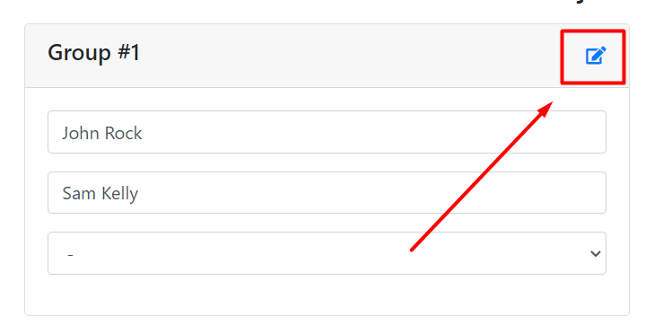

# Status Page Documentation

## Task


---

## Task Requirements

Some of the **task requirements** were challenging and interesting to create.


I have implemented all functional requirements. The hardest task was 5th one, when I needed to implement student assignment to groups. I was creating bunch of solutions regarding this one, but I have managed to choose similar approach as per provided mockup.

---

## About project

Technologies used for the project:

* Front end - **CSS** and **Javascript** (`VueJS`)

* Back end - **PHP**

---

## Instructions on launching application

### **Database Schemas**

There are 2 database schema (`.sql`) files in `/resources` folder: `status_page.sql` (without data) and `status_page_with_data.sql` (with sample data).

&nbsp;

### **Files upload**

Upload all project files to a web server and launch application in `"/"` route (it will start from `index.php` file).

---

## Task Implementation

My project has 2 main pages: `index.php` and `project.php`

### **index.php**

In the main page you will be able to create as many projects as you want.


&nbsp;

To create a project, you will need to enter:

* Title

* Number of groups in the project (*maximum of 10*)
 
* Maximum number of student in group (*maximum of 10*) 


---

### **project.php**

In the **project** page, you will be able to manage chosen project.


At the top of the page, you will see:

1. Button to go back to all projects page (`index.php`)

1. Title of the project and below it there is a number of groups and maximum amount of students in group

&nbsp;

Below, you will see the list of all students of the project.


Here, you can add and delete students. Also, each student's group will be visible (*`"No group"`, if not in a group*).

&nbsp;

To add new student, you will need to enter:

* First Name

* Last Name
 
* Group (*optional*) 


&nbsp;

Main section of the page is here. Here, you can manage your project groups, assign and remove students from them.


As you can see, groups are auto generated, when project is being created (*In this example project - **number of groups: 4** | **max amount of students in group: 3***).
When the group is full, it's being highlighted and it's really noticable, that the group is full.

&nbsp;

To add student to the group, you will need to choose student from the dropdown list here:


As you can see, current students of the group are not displayed in the list, and students, that are in the other groups have their group name shown.

&nbsp;

#### **Edit group mode**

You can edit group by clicking here:



After that, group will be in edit mode and you will be able to remove students from the group:


P.S. There is a text input field in group name's place in edit mode, that should allow changing the name of the group, however I haven't yet implemented it, so that will be implemented in the near future [:)]

---

## Bonus Requirements

I have managed to complete 2 out of 3 **bonus requirements**.


**Bonus requirements summary:**

1. **(Not completed)** 

1. I have implemented POST endpoint for **adding new student to the project** - `/api/add_student.php`

1. Using **PHPUnit** framework, I have created single test, that checks if student is getting deleted (test in `/tests/unit/StudentsLoaderTest.php`) 

&nbsp;

### **API Endpoint**

For checking POST request in **Postman** *(or other software)* add header:
* **Content-Type** with value of **application/json**

**Required parameters:**

* First name (in request - **first_name**)

* Last name (in request - **last_name**)

* Project ID (in request - **project_id**)

**Optional parameters:**

* Group ID (in request - **group_id**), if you wish to add that students to specific group. If the group is full, you won't be able to add new student to that group.

#### **Example 1:**

```JSON
{
  "first_name": "Mike",
  "last_name": "Mikey",
  "project_id": 1
}
```


&nbsp;

**Response:**


&nbsp;

#### **Example 2:**

```JSON
{
  "first_name": "Luke",
  "last_name": "Campbell",
  "project_id": 1,
  "group_id": 1
}
```


&nbsp;

**Response:**


As you can see, with optional **group_id** paramater, new student was added to **Group #1** (*id: 1*) as well.

&nbsp;

### **Unit test**

To launch unit test for `/tests/unit/StudentsLaoderTest.php` file:

* Open up a terminal from the home path. For example:


* And there, execute this command to run tests within `/tests/unit`:
```
  vendor/bin/phpunit
```

&nbsp;

After that, you should be able to see test results:


---

## Conclusion

Overall, I was really enjoying creating this project, since task was really interesting and challenging at some point. I believe I have gathered a lot of useful information and acquired additional skills while developing this application. 

I am looking forward to developing this project further and I have some great ideas to make it much better in the future.

P.S. Modals were not created from my side, all kudos goes to this person [HERE](https://codesandbox.io/s/github/vuejs/vuejs.org/tree/master/src/v2/examples/vue-20-modal-component?from-embed=&file=/index.html "VueJS Modal").